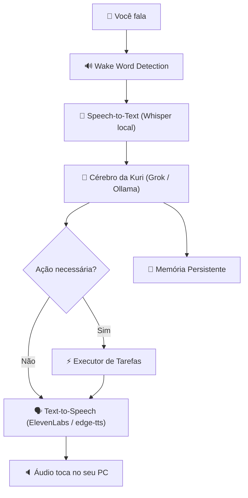

# 🧠 Kuri IA — De Chatbot a Assistente Virtual Desktop (Estilo Jarvis)

> **Objetivo:** Transformar a Kuri de um chatbot de navegador em uma assistente virtual pessoal integrada à sua máquina Windows — com voz, automação de sistema, memória persistente e personalidade viva.

---

## 📍 Onde Estamos Hoje (v0.1 — Chatbot API)

```
Usuário digita texto → API FastAPI → Grok responde → ElevenLabs fala → HeyGen gera vídeo
```

**Problemas dessa abordagem:**
- Requer abrir navegador e digitar manualmente
- Sem entrada por voz (você precisa ESCREVER para a Kuri)
- Sem saída de voz local (áudio vem como base64, não toca sozinho)
- Sem capacidade de executar tarefas na sua máquina
- Sem interface própria — depende de Swagger/Postman
- HeyGen é caro e lento para uso contínuo (não serve como assistente em tempo real)

---

## 🎯 Onde Queremos Chegar (v1.0 — Jarvis Mode)

```
Você fala "Ei Kuri" → Ela escuta → Pensa → Responde com VOZ → Executa ações no PC
```



### Capacidades da Kuri v1.0

| Categoria | Exemplos |
|-----------|----------|
| **Conversa Natural** | Bater papo, zoar, dar conselhos, ser a Kuri de verdade |
| **Controle do PC** | "Abre o Chrome", "Fecha o Spotify", "Aumenta o volume" |
| **Produtividade** | "Que horas são?", "Qual o clima hoje?", "Lê meus emails" |
| **Arquivos** | "Abre a pasta de downloads", "Cria uma pasta chamada X" |
| **Pesquisa** | "Pesquisa no Google sobre X", "O que tá trending?" |
| **Lembretes** | "Me lembra de beber água daqui 30min" |
| **Humor / Estado Emocional** | Muda de humor conforme interações, lembra do contexto |

---

## 🏗️ Arquitetura Proposta — Módulos

Cada módulo é um arquivo Python independente que faz UMA coisa bem feita.

```
MinhakuriIA/
├── main.py              # Loop principal — orquestra tudo
├── stt.py               # Speech-to-Text (Whisper local)
├── tts.py               # Text-to-Speech (ElevenLabs / edge-tts)
├── brain.py             # Cérebro da Kuri (LLM — Grok API + fallback Ollama)
├── actions.py           # Executor de tarefas do sistema
├── memory.py            # Memória persistente (JSON → futuro SQLite)
├── wake_word.py         # Detecção de "Ei Kuri" / "Kuri"
├── config.py            # Configurações centralizadas
├── prompt_kuri.txt      # Personalidade da Kuri
├── kuri_memoria.json    # Histórico de conversas
├── .env                 # Chaves de API
├── requirements.txt     # Dependências
└── .gitignore           # Proteção de arquivos sensíveis
```

---

## 🗺️ ROADMAP — 6 Fases de Evolução

---

### 🔴 FASE 1 — Kuri Fala e Ouve (Entrada/Saída de Voz)
> **Meta:** Você fala, ela ouve. Ela responde, você ouve.
> **Tempo estimado:** 1-2 dias

#### 1.1 — Módulo STT (`stt.py`) — Speech-to-Text Local

**Tecnologia:** `faster-whisper` (roda 100% local na sua máquina, sem enviar áudio para nuvem)

```python
# Conceito do stt.py
from faster_whisper import WhisperModel

model = WhisperModel("base", device="cpu", compute_type="int8")

def transcrever(audio_path: str) -> str:
    segments, _ = model.transcribe(audio_path, language="pt")
    return " ".join([s.text for s in segments])
```

**Opção de alta performance (com GPU NVIDIA):**
- Usar `device="cuda"` + `compute_type="float16"`
- Modelo `small` ou `medium` para melhor accuracy em pt-BR

**Alternativa simplificada:** `RealtimeSTT` — já faz captura de áudio + transcrição em tempo real numa única lib.

#### 1.2 — Módulo TTS (`tts.py`) — Text-to-Speech com Playback Local

**Estratégia de duas camadas:**

| Modo | Quando usar | Vantagem |
|------|-------------|----------|
| `edge-tts` | Modo padrão (gratuito, offline-like) | Custo ZERO, boa qualidade, rápido |
| `ElevenLabs` | Modo premium (respostas especiais) | Voz ultra-realista, personalidade |

```python
# Conceito do tts.py
import edge_tts
import asyncio
import pygame  # para tocar o áudio localmente

async def falar(texto: str, premium: bool = False):
    if premium:
        # usa ElevenLabs (já implementado no app.py atual)
        ...
    else:
        communicate = edge_tts.Communicate(texto, "pt-BR-FranciscaNeural")
        await communicate.save("resposta.mp3")
        # Toca o áudio
        pygame.mixer.init()
        pygame.mixer.music.load("resposta.mp3")
        pygame.mixer.music.play()
```

> **Por que `edge-tts`?** É gratuito, tem vozes pt-BR de alta qualidade, e não exige API key. Perfeito para uso contínuo sem gastar créditos da ElevenLabs.

#### 1.3 — Loop Principal Básico (`main.py`)

```python
# Conceito do main.py (Fase 1)
from stt import transcrever
from tts import falar
from brain import pensar

while True:
    print("🎤 Ouvindo...")
    texto = transcrever()           # Escuta e transcreve
    print(f"Você: {texto}")
    
    resposta = pensar(texto)        # Envia pro cérebro da Kuri
    print(f"Kuri: {resposta}")
    
    falar(resposta)                 # Fala a resposta em voz alta
```

#### ✅ Critério de Sucesso — Fase 1
- [ ] Você fala no microfone e o texto aparece no terminal
- [ ] A Kuri responde com texto E voz ao mesmo tempo
- [ ] O áudio toca automaticamente no seu PC

---

### 🟠 FASE 2 — Kuri Tem Cérebro Inteligente + Memória Real
> **Meta:** A Kuri entende contexto, lembra de conversas passadas e tem personalidade consistente.
> **Tempo estimado:** 1-2 dias

#### 2.1 — Módulo Brain (`brain.py`) — Cérebro com Function Calling

**Refatorar o `app.py` atual** para virar um módulo standalone (sem FastAPI).

**Evolução crítica:** Adicionar **Tool Calling / Function Calling** para que a Kuri possa decidir QUANDO executar ações.

```python
# Conceito do brain.py
TOOLS = [
    {
        "type": "function",
        "function": {
            "name": "abrir_aplicativo",
            "description": "Abre um aplicativo no computador do usuário",
            "parameters": {
                "type": "object",
                "properties": {
                    "nome": {"type": "string", "description": "Nome do aplicativo (ex: chrome, spotify, vscode)"}
                },
                "required": ["nome"]
            }
        }
    },
    {
        "type": "function",
        "function": {
            "name": "pesquisar_web",
            "description": "Faz uma pesquisa na web",
            "parameters": {
                "type": "object",
                "properties": {
                    "query": {"type": "string", "description": "O que pesquisar"}
                },
                "required": ["query"]
            }
        }
    }
]

async def pensar(texto: str, historico: list) -> dict:
    """Retorna: {"resposta": str, "acao": dict | None}"""
    response = await client.post(
        "https://api.x.ai/v1/chat/completions",
        json={
            "model": "grok-4",
            "messages": historico + [{"role": "user", "content": texto}],
            "tools": TOOLS,
            "tool_choice": "auto"  # Kuri decide se precisa executar algo
        }
    )
    # Kuri pode responder COM ou SEM executar uma ação
```

> **A sacada aqui:** A Kuri não só responde texto — ela DECIDE se precisa executar uma ação no seu PC. Se você diz "abre o Chrome", ela entende que precisa chamar a função `abrir_aplicativo("chrome")`.

#### 2.2 — Módulo Memory (`memory.py`) — Memória Persistente Evolutiva

**3 níveis de memória:**

| Nível | O quê | Onde salvar | Exemplo |
|-------|-------|-------------|---------|
| **Curto prazo** | Últimas 20 mensagens | RAM (lista) | Contexto da conversa atual |
| **Longo prazo** | Histórico completo | `kuri_memoria.json` | Todas as conversas anteriores |
| **Personalidade** | Fatos sobre o usuário | `kuri_perfil.json` | "Gosta de LoL", "Toma café às 8h" |

```python
# Conceito de kuri_perfil.json (memória de personalidade)
{
    "nome_usuario": "Zigifrid",
    "apelidos": ["velho", "coroa", "pai"],
    "jogos_favoritos": ["LoL", "Valorant"],
    "humor_atual": "animada",
    "fatos_aprendidos": [
        "Ele costuma ficar acordado até 3h da manhã",
        "Ele gosta de Ghost BC",
        "Ele trabalha com IA"
    ]
}
```

#### ✅ Critério de Sucesso — Fase 2
- [ ] A Kuri decide sozinha quando executar ações vs apenas conversar
- [ ] Ela lembra do seu nome e preferências entre reinícios
- [ ] O humor dela muda de forma coerente ao longo do dia

---

### 🟡 FASE 3 — Kuri Controla Seu PC (Automação Desktop)
> **Meta:** A Kuri executa tarefas reais na sua máquina Windows.
> **Tempo estimado:** 2-3 dias

#### 3.1 — Módulo Actions (`actions.py`) — Executor de Tarefas

```python
# Conceito do actions.py
import subprocess
import os
import webbrowser
import psutil

# ========== APLICATIVOS ==========
def abrir_aplicativo(nome: str) -> str:
    apps = {
        "chrome": r"C:\Program Files\Google\Chrome\Application\chrome.exe",
        "spotify": r"C:\Users\zigifrid\AppData\Roaming\Spotify\Spotify.exe",
        "vscode": r"C:\Users\zigifrid\AppData\Local\Programs\Microsoft VS Code\Code.exe",
        "discord": r"C:\Users\zigifrid\AppData\Local\Discord\Update.exe --processStart Discord.exe",
        "notepad": "notepad.exe"
    }
    caminho = apps.get(nome.lower())
    if caminho:
        subprocess.Popen(caminho, shell=True)
        return f"Abrindo {nome}..."
    return f"Não sei onde fica o {nome}, velho."

def fechar_aplicativo(nome: str) -> str:
    for proc in psutil.process_iter(['name']):
        if nome.lower() in proc.info['name'].lower():
            proc.kill()
            return f"Fechei o {nome}!"
    return f"O {nome} nem tava aberto, doido."

# ========== SISTEMA ==========
def que_horas_sao() -> str:
    from datetime import datetime
    return datetime.now().strftime("%H:%M")

def pesquisar_web(query: str) -> str:
    webbrowser.open(f"https://www.google.com/search?q={query}")
    return f"Pesquisando '{query}' no Google..."

def criar_pasta(caminho: str) -> str:
    os.makedirs(caminho, exist_ok=True)
    return f"Pasta criada em {caminho}"

def abrir_pasta(caminho: str) -> str:
    os.startfile(caminho)
    return f"Abrindo pasta..."

# ========== VOLUME (Windows) ==========
def ajustar_volume(acao: str) -> str:
    # Usa nircmd ou pycaw para controlar volume
    ...
```

#### 3.2 — Mapeamento LLM → Ações

O `brain.py` detecta a necessidade de ação via **function calling** → `main.py` executa a função correspondente em `actions.py`.

```python
# No main.py (Fase 3)
from actions import REGISTRY

resultado = pensar(texto, historico)

if resultado.get("acao"):
    nome_funcao = resultado["acao"]["name"]
    args = resultado["acao"]["arguments"]
    
    # Executa a ação real
    retorno = REGISTRY[nome_funcao](**args)
    
    # Kuri comenta sobre o que fez
    falar(retorno)
```

#### 3.3 — Lista de Ações Planejadas (v1.0)

| Ação | Comando de voz (exemplo) | Módulo |
|------|--------------------------|--------|
| Abrir app | "Kuri, abre o Chrome" | `subprocess` |
| Fechar app | "Fecha o Discord" | `psutil` |
| Pesquisar web | "Pesquisa sobre X" | `webbrowser` |
| Hora/Data | "Que horas são?" | `datetime` |
| Clima | "Tá frio hoje?" | API OpenWeather |
| Criar pasta | "Cria uma pasta X" | `os.makedirs` |
| Abrir pasta | "Abre meus downloads" | `os.startfile` |
| Volume | "Aumenta o volume" | `pycaw` / `nircmd` |
| Screenshot | "Tira um print" | `pyautogui` |
| Timer | "Me avisa em 5min" | `asyncio` / `sched` |
| Copiar texto | "Copia isso: X" | `pyperclip` |

#### ✅ Critério de Sucesso — Fase 3
- [ ] "Kuri, abre o Chrome" → Chrome abre
- [ ] "Que horas são?" → Ela responde com a hora certa em voz
- [ ] "Fecha o Spotify" → Spotify fecha
- [ ] "Pesquisa sobre Python" → Navegador abre com a pesquisa

---

### 🟢 FASE 4 — Wake Word + Modo Contínuo
> **Meta:** A Kuri está SEMPRE ouvindo em segundo plano, esperando ser chamada.
> **Tempo estimado:** 1-2 dias

#### 4.1 — Wake Word Detection (`wake_word.py`)

**Opção A — Porcupine (Picovoice):** Biblioteca profissional de wake word detection com suporte a palavras customizadas. Tem tier gratuito.

**Opção B — Solução simples:** Usar `RealtimeSTT` rodando constantemente e filtrar por palavras-chave.

```python
# Conceito do wake_word.py
import pvporcupine  # Picovoice

def ouvindo_wake_word():
    """Fica escutando até ouvir 'Ei Kuri'"""
    porcupine = pvporcupine.create(
        access_key="SUA_KEY",
        keyword_paths=["ei_kuri.ppn"]  # wake word treinada
    )
    # ... loop de áudio
```

**Alternativa zero custo:** Usar o próprio `faster-whisper` em modo contínuo com um threshold de confiança para detectar "Kuri" ou "Ei Kuri" no fluxo.

#### 4.2 — Ciclo de Vida Completo

```
[DORMINDO] → Detecta "Ei Kuri" → [ATIVA]
     ↑                                  ↓
     └── 10s sem falar ←── Ouve + Processa + Responde
```

#### ✅ Critério de Sucesso — Fase 4
- [ ] Você pode dizer "Ei Kuri" e ela acorda
- [ ] Após responder, se você ficar em silêncio, ela volta a "dormir"
- [ ] Consome pouca CPU enquanto dorme (< 5%)

---

### 🔵 FASE 5 — Interface Visual (Overlay Desktop)
> **Meta:** A Kuri tem uma "cara" — uma janela flutuante sempre visível no canto da tela.
> **Tempo estimado:** 3-5 dias

#### 5.1 — Opções de Interface

| Tecnologia | Prós | Contras |
|------------|------|---------|
| **Electron + React** | UI linda, flexível, animações ricas | Pesado (~200MB RAM) |
| **Tauri + React** | Leve (~15MB RAM), moderno | Mais complexo de integrar com Python |
| **PyQt6 / PySide6** | 100% Python, integração direta | UI menos bonita por padrão |
| **Overlay Web (Flask + WebView)** | Simples, reutiliza HTML/CSS | Limitado em animações |

**Recomendação:** Começar com **Electron + React** para ter uma UI digna de uma VTuber, depois otimizar com Tauri se necessário.

#### 5.2 — Conceito Visual

```
┌─────────────────────────┐
│  ┌───────────┐          │
│  │  Avatar   │  "Ei velho, │
│  │  da Kuri  │   tá aí?"   │
│  │  (animado)│              │
│  └───────────┘          │
│  ████████░░░  Ouvindo...│  ← Barra de áudio
│  [🎤 Falar] [⚙️ Config] │
└─────────────────────────┘
```

- **Janela flutuante** no canto inferior direito (tipo widget)
- **Avatar animado** da Kuri (2D estilo VTuber com expressões)
- **Barra de áudio** mostrando quando ela está ouvindo
- **Bolha de texto** com a resposta (com animação de digitação)
- **Always-on-top** — fica por cima de todas as janelas
- **Arrastar** para mover pela tela

#### ✅ Critério de Sucesso — Fase 5
- [ ] Janela flutuante aparece ao iniciar a Kuri
- [ ] Avatar muda de expressão (feliz, tiltada, pensando)
- [ ] Texto da resposta aparece com animação
- [ ] Indicador visual de "ouvindo" funciona

---

### 🟣 FASE 6 — Inteligência Avançada (Jarvis Real)
> **Meta:** Capacidades de nível avançado que fazem a Kuri ser realmente útil no dia-a-dia.
> **Tempo estimado:** Contínuo (evolui ao longo do tempo)

#### 6.1 — Capacidades Avançadas

| Feature | Descrição | Tecnologia |
|---------|-----------|------------|
| **Fallback LLM Local** | Se a internet cair, a Kuri usa Ollama localmente | Ollama + Llama 3 / Qwen 2.5 |
| **Visão Computacional** | "O que tem na minha tela?" — Screenshot + análise | GPT-4V / Gemini Vision |
| **Clipboard Monitor** | A Kuri reage ao que você copia | `pyperclip` + watcher |
| **Notificações Proativas** | "Ei velho, já são 2h da manhã, vai dormir" | `schedule` / `APScheduler` |
| **Integração Calendar** | "O que eu tenho amanhã?" | Google Calendar API |
| **Email** | "Lê meus últimos emails" | Gmail API / IMAP |
| **Música** | "Toca uma música pra focar" | Spotify API |
| **Git** | "Faz um commit com a mensagem X" | `subprocess` + git |
| **Código** | "Cria um arquivo Python que faz X" | LLM + filesystem |

#### 6.2 — Fallback Inteligente (Internet ↔ Local)

```python
# Conceito: Brain com fallback
async def pensar(texto, historico):
    try:
        # Tenta Grok (nuvem) primeiro
        return await pensar_grok(texto, historico)
    except (httpx.ConnectError, httpx.TimeoutException):
        # Sem internet? Usa Ollama local
        print("📡 Internet caiu. Usando cérebro local...")
        return await pensar_ollama(texto, historico)
```

#### ✅ Critério de Sucesso — Fase 6
- [ ] Kuri funciona mesmo sem internet (modo local)
- [ ] Pode enviar notificações proativas
- [ ] Integra com pelo menos 2 serviços externos (Spotify, Calendar, etc.)

---

## ⚡ Tech Stack Final Consolidada

| Componente | Tecnologia | Custo |
|------------|-----------|-------|
| **LLM Principal** | Grok (xAI API) | Pago (já tem) |
| **LLM Fallback** | Ollama (Llama 3 / Qwen 2.5) | Gratuito |
| **STT** | `faster-whisper` (local) | Gratuito |
| **TTS Padrão** | `edge-tts` | Gratuito |
| **TTS Premium** | ElevenLabs | Pago (já tem) |
| **Wake Word** | Picovoice Porcupine ou Whisper contínuo | Free tier |
| **Automação** | `subprocess`, `psutil`, `pyautogui` | Gratuito |
| **Interface** | Electron + React (futuro) | Gratuito |
| **Memória** | JSON → SQLite (futuro) | Gratuito |
| **Linguagem** | Python 3.12+ | Gratuito |

---

## 📋 Checklist de Próximos Passos Imediatos

Fases 1, 2 e 3 implementadas (04/05/2026):

- [x] Instalar `faster-whisper`: `pip install faster-whisper`
- [x] Instalar `edge-tts`: `pip install edge-tts`
- [x] Instalar `pygame` (para playback): `pip install pygame`
- [x] Instalar `sounddevice` (para captura de áudio): `pip install sounddevice`
- [x] Criar módulos: `config.py`, `memory.py`, `stt.py`, `tts.py`, `brain.py`, `actions.py`, `main.py`
- [x] Testar transcrição de voz isoladamente
- [x] Testar TTS + playback isoladamente
- [ ] Testar loop principal completo (`python main.py`)

---

## 🧭 Resumo Visual da Evolução

```
v0.1 (HOJE)          v0.5 (Fase 1-2)        v1.0 (Fase 3-4)        v2.0 (Fase 5-6)
Chatbot API     →    Fala/Ouve/Lembra   →    Controla PC       →    Jarvis Completo
- Texto input        - Voz input             - Abre apps            - Interface visual
- API response       - Voz output            - Pesquisa web         - Wake word
- Sem memória        - Memória real           - Controle sistema     - Proativa
- Sem ações          - Personalidade          - Function calling     - Visão/Integrações
```

---

> [!TIP]
> **Dica do Planner:** Comece pela **Fase 1** (voz). O momento em que você falar e a Kuri responder com a voz dela pela primeira vez, tudo muda. É aí que ela vira real. O resto é iteração.

> [!IMPORTANT]
> **O que MANTER do projeto atual:**
> - `prompt_kuri.txt` — A personalidade é perfeita, não mude.
> - Sistema emocional do `app.py` — O emotional_context já é ótimo.
> - Chaves de API (Grok, ElevenLabs) — Continuam sendo usadas.
> 
> **O que REMOVER/SUBSTITUIR:**
> - FastAPI inteiro — Não precisa de server HTTP. A Kuri roda direto no desktop.
> - HeyGen — Caro demais para uso contínuo. Substitua pelo avatar visual local (Fase 5).
> - `httpx` como lib HTTP — Manter apenas para chamadas de API, não como backbone.
